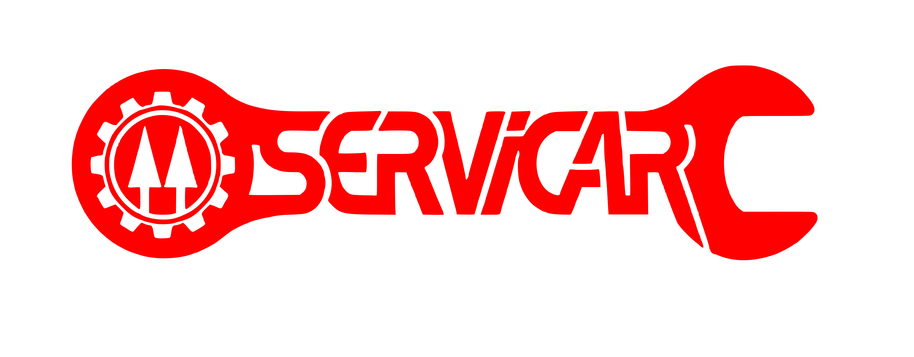

# Servicar — Frontend (Next.js)

Aplicación web del sistema de gestión de taller de autobuses **Servicar**. Construida sobre [Once UI](https://once-ui.com) para [Next.js](https://nextjs.org).



## Requisitos

- Node.js v18.17+
- pnpm v8+

## Inicio rápido

**1. Instalar dependencias** (desde la raíz del monorepo)
```bash
pnpm install
```

**2. Levantar servidor de desarrollo**
```bash
cd next
pnpm dev
```

**3. Configurar UI**
```
src/resources/once-ui.config.ts
```

**4. Configurar contenido y metadatos**
```
src/resources/content.tsx
```

## Arquitectura

El frontend sigue una arquitectura en capas:

```
src/
├── app/                  # Rutas Next.js (App Router)
│   ├── (mecanico)/       # Rutas protegidas del mecánico
│   ├── admin/            # Rutas protegidas del administrador
│   ├── login/            # Autenticación
│   └── ticket/           # Creación y edición de tickets
├── presentation/
│   ├── coordinators/     # Navegación entre pantallas
│   ├── view-models/      # Lógica de cada vista (hooks)
│   └── views/            # Componentes de UI puros
├── modules/              # Inicialización de módulos (DI)
├── lib/                  # Cliente de base de datos (Convex)
└── resources/            # Configuración y contenido estático
```

Depende del paquete interno `@servicar/core` (dominio y casos de uso) que vive en `packages/core/`.

## Roles de usuario

| Rol | Acceso |
|-----|--------|
| **Mecánico** | UI móvil — crea y edita sus propios tickets |
| **Administrador** | Panel desktop — aprueba, rechaza y reasigna cualquier ticket |
| **Cliente** | Consulta pública de ticket por ID (sin auth) |

## Stack

- Next.js 16, React 19, TypeScript
- Once UI (`@once-ui-system/core`) — componentes y tokens de diseño
- Convex — base de datos en tiempo real
- Biome — linter y formatter
